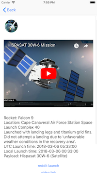

# SpaceX

Simple iOS client application for consuming SpaceX API.

### Dependencies

To compile and run the project install the following:
- **Xcode**
- **CocoaPods**
- **YouTubePlayer**

Commands that may be useful:
```shell
sudo gem install cocoapods
git clone https://github.com/adamgic/SpaceX.git
cd SpaceX/
pod install
```


## Description

iOS client application, consuming API from SpaceX available [here](https://api.spacexdata.com/v2/launches/). Simple architecture explaining the purpose of the project. Presenting informations about rocket launches.

### Covered topics

- use of **UIKit** components
- **URLSession** to perform API calls
- **Decodable** protocol to decode JSON
- **XCTest** for Unit Testing and UI Testing
- use of **DateFormatter** to get local time and UTC
- **Foundation** and **Swift 4**

### Features

List of available launches providing information about

- mission patch
- flight number
- rocket name
- launch date
- launch site
- visual indicator describing launch success


Data presented in **UITableView** with option of filtering with respect to launch success.

Details view of a launch providing information about

- details of the mission
- UTC launch time
- local launch time
- payloads
- links placed in **UIStackView** dynamically, allowing user to browse the content
- embedded preview of YouTube video



Web content browsing using **SFSafariViewController**.


Unit Test for parsing JSON file. UI Test navigating through the appilication.
